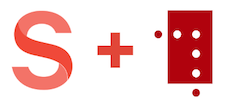

# sanity-plugin-asset-source-nbiiif

Plugin for [Sanity Studio](https://www.sanity.io) providing a [NB.no](https://nb.no) (National Library of Norway) asset source. Get a thumbnail of the document and a link to the [IIIF manifest](https://iiif.io/api/presentation/2.0/#introduction) in `asset.source.url`.

## Installation

In your studio folder, run:

```bash
sanity install asset-source-nbiiif
```

## The National Library of Norway API

The National Library of Norway have great APIs and a huge collection of digitized documents. Amazing stuff!

Checkout https://api.nb.no/. 

## Credit 

Thanks to XSlemX for doing the real work -> [sanity-plugin-asset-source-giphy](https://github.com/XSlemX/sanity-plugin-asset-source-giphy)! 

