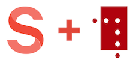

# sanity-plugin-asset-source-nbiiif

Plugin for [Sanity Studio](https://www.sanity.io) providing a [NB.no](https://nb.no) (National Library of Norway) asset source. Get a thumbnail of the document and a link to the [IIIF manifest](https://iiif.io/api/presentation/2.0/#introduction) in `asset.source.url`.

## Installation

In your studio folder, run:

```bash
sanity install asset-source-nbiiif
```

## The National Library of Norway API

The National Library of Norway have great APIs and a huge collection of digitized documents. Amazing stuff!

Check out [api.nb.no](https://api.nb.no/)!

## IIIF.io

[International Image Interoperability Framework](https://iiif.io) (IIIF) is just brilliant 💯.

> ...a set of shared application programming interface (API) specifications for interoperable functionality in digital image repositories. The IIIF is comprised of and driven by a community of libraries, museums, archives, software companies, and other organizations working together to create, test, refine, implement and promote the IIIF specifications. Using JSON-LD, linked data, and standard W3C web protocols such as Web Annotation, IIIF makes it easy to parse and share digital image data, migrate across technology systems, and provide enhanced image access for scholars and researchers.

This plugin makes it easy to get link to IIIF manifest that you can use with the [Mirador](https://projectmirador.org/) IIIF viewer.

## Credit 

Thanks to XSlemX for doing the real work -> [sanity-plugin-asset-source-giphy](https://github.com/XSlemX/sanity-plugin-asset-source-giphy)! 

