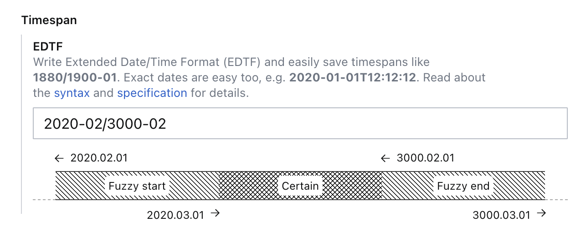

# sanity-plugin-timespan-input

> This is a **Sanity Studio v3** plugin.
> For the v2 version, please install the v2.0.2 version.
> `npm install @seidhr/sanity-plugin-timespan-input@v2.0.2`

Make it easier to add timespan information with the help of Extended Date Time Format (EDTF). It will validate the EDTF input and provide a preview of the timespan.



## Schema

The plugin stores the edft string and maps to the CIDOC-CRM model for timespan. The stored object will look something like this:

```js
{
  _type: 'Timespan',
  edtf: "2020-01-01/2020-02-01"
  date: "2020-01-01T00:00:00.000Z",
  beginOfTheBegin: "2020-01-01T00:00:00.000Z",
  endOfTheBegin: "2020-01-02T00:00:00.000Z",
  beginOfTheEnd: "2020-02-01T00:00:00.000Z",
  endOfTheEnd: "2020-02-02T00:00:00.000Z",
}
```

Depending on the EDTF string, some of the properties might be `null`. If a precise date is given, the `date` property will be set to that date. If an unprecise date is given, the `beginOfTheBegin` and `endOfTheEnd` properties will be set to the start and end of the range. If an Interval is entered, eg. `2020/` or `2020/3001`, necessary start and end dates will be set.

## Usage

```js
import { timespanInput } from '@seidhr/sanity-plugin-timespan-input'

export default defineConfig({
  name: 'default',
  title: 'example-studio',

  projectId: '...',
  dataset: 'production',

  plugins: [
    timespanInput(),
  ],

  schema: {
    types: [
      ...schemaTypes
    ],
  },
})
```

Use `Timespan` in your schema:

```js
// [...]
{
  fields: [
    // [...]
    defineField({
      name: 'timespan',
      title: 'Timespan',
      type: 'Timespan',
    }),
  ]
}
```


## License

MIT © Tarje Lavik
See LICENSE